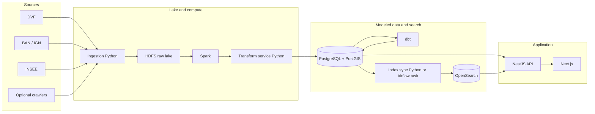

# HOMEPEDIA — French housing insights platform

## 1 Purpose

HOMEPEDIA is a data-driven product that helps users understand the French housing market through maps, search, filters, and aggregates at **city, department, region and state** levels. It combines statistical and geospatial views so users can compare areas and follow trends over time. Beyond prices and transactions, it aims to build a **territory profile** by combining housing signals with **context indicators** (demographics, economy, education, energy, environment, infrastructure, public services) at multiple administrative scales.

### 1.1 Indicator enrichment

Principle: ingest indicator datasets from trusted open sources, normalize them to a common **geographical key** (INSEE codes + reference geographies), then publish curated marts for the API/UI.

- **Housing & home-level market data (price, m², type, …)**
  - **DVF**: notarized **sale** price, date, surface and property type when present - one row per **transaction**; public files update on a **schedule** (suitable for trends and aggregates).
  - **Listings** (crawl, optional): this is the path for “what is on the market now.”
  - **Modeling**: typically `fact_transaction` + `dim_property` (DVF) and `fact_listing` (annonces), linked to geography via **BAN** / commune (and IRIS when you use it).

- **Geographical backbone (joins across datasets)**
  - **INSEE COG** (communes, departments, regions, historical changes): provides stable codes and hierarchy.
  - **IGN Admin Express / GEOFLA-like boundaries**: polygons for choropleths; store geometry in PostGIS.
  - **BAN (Base Adresse Nationale)**: address-level reference to connect property/location to commune/IRIS when needed.
  - **Postal codes (La Poste / Etalab)**: official postal-code ↔ commune mapping; powers postal-code search and normalizes user queries to INSEE keys.

- **Population & demographics**
  - **INSEE**: population, age structure, household composition, migration, density (commune/department/region; sometimes IRIS).

- **Economy & employment**
  - **INSEE (Filosofi, revenues, poverty, taxes)**: income distribution and poverty indicators (often commune/IRIS).
  - **INSEE (SIRENE / establishments counts)**: business fabric proxies by commune.
  - **DARES / France Travail open data (where available)**: unemployment and labor-market indicators (often department/zone).
  - **INSEE (RP — socio-professional categories, CSP)**: census breakdown of the population by socio-professional category; feeds a CSP-diversity (social-mix) signal.
  - **DGFiP (property tax / taxe foncière)**: local property-tax rates, i.e. the recurring holding cost of owning in a commune.

- **Finance & affordability**
  - **ECB MIR series (France, monthly)**: housing-loan interest rate for households; drives a **real borrowing capacity** computation (replaces any hard-coded rate assumption).

- **Safety & security**
  - **SSMSI (communal recorded crime)**: recorded offences per commune; aggregated into a crime rate used as an inverse safety signal.

- **Social mix & urban policy**
  - **ANCT (QPV — priority neighbourhoods / quartiers prioritaires de la ville)**: perimeter and presence of priority policy neighbourhoods; used as a social-mix indicator.

- **Education**
  - **MENJ / Education nationale open data**: school locations, enrollments, exam success rates (typically établissement; aggregate to commune/department).
  - **INSEE**: education attainment levels from census aggregates (commune/department/region).

- **Energy & buildings**
  - **DPE open data (ADEME / data.gouv)**: energy performance certificates (building-level; aggregate by commune/IRIS, compute distributions A–G).
  - **RTE / Enedis open data (as applicable)**: electricity consumption/production proxies (often departmental/regional).

- **Environment & climate**
  - **Atmo France (air quality) / local AASQA feeds**: pollution indices (stations → interpolate or aggregate by area).
  - **Copernicus / CORINE Land Cover**: land-use, artificialization proxies (grid/polygons → aggregate to admin areas).
  - **Météo/climate normals (open datasets when permitted)**: temperature/precipitation normals (grid → aggregate).

- **Infrastructure & accessibility**
  - **OpenStreetMap extracts (via Geofabrik)**: amenities density, transport stops, green spaces (compute spatial aggregates).
  - **ARCEP open data**: internet coverage and quality indicators (often commune/department).
  - **SNCF / GTFS feeds (where open)**: accessibility to stations and travel-time proxies (compute isochrones or nearest-stop metrics).

Implementation notes (data platform):
- Keep raw sources as `raw_*` tables/files; add a `dim_location` keyed by INSEE codes (and optional IRIS) as the primary join target.
- Prefer publishing **normalized, time-stamped** indicators (e.g. `indicator_unemployment_rate`, `indicator_income_median`) so trends can be charted and compared consistently.
- Each source follows the same intake contract: a **Python loader** + `schema.sql` + a `scripts/load_*.sh` runner, then **dbt models** (staging → core) and an **Airflow task**. Every runner is also wired into `scripts/load_all_default.sh` so a full refresh loads all sources in one command. The most recent additions — ECB housing-loan rate, DGFiP property tax, ANCT QPV, INSEE RP socio-professional categories, SSMSI crime, and La Poste postal codes — all follow this contract.

## 2 Learning and delivery objective

Deliver a **scalable data platform** and **web application** that demonstrates:

| Area | Technologies |
|------|----------------|
| Big data | Hadoop, HDFS, Spark (PySpark) |
| Data engineering | Python, ETL, Airflow, dbt |
| API | NestJS (Node.js) |
| Client | Next.js (React) |
| Geospatial | PostgreSQL + PostGIS |

---

## 3 High-level architecture

Data flows from external sources through batch processing and modeling into stores that back an API and a Next.js frontend. **Chosen rule:** the warehouse (Postgres + dbt marts) is the **single source of truth** for structured data; **OpenSearch is a read-optimized projection** built **after** marts, not in parallel from the transform service.



**Narrative:** sources → ingestion → **HDFS** (immutable file history) → **Spark** (scale cleaning) → **transform service** (loads **Postgres `raw_*`**, geocoding, APIs, logic that is awkward in SQL) → **dbt** (staging → core → marts, tests) → **index sync** (materialized mart → OpenSearch bulk API) → **NestJS** reads Postgres and OpenSearch → **Next.js** UI.

### 3.1 Where each layer owns the work

| Concern | Owner | Notes |
|--------|--------|--------|
| Byte-true history, replay | **HDFS** | Files as collected or exported; not queried for the app. |
| First **relational** land in the warehouse | **Transform service → Postgres `raw_*`** | Loaded from Spark outputs (or controlled direct loads). Still “raw” for dbt: wide columns, source quirks. |
| Conformed keys, star schema, aggregates | **dbt** on Postgres | Staging views, `int_*` / `normalized_*`, `dim_*` / `fact_*` / `agg_*`. |
| Full-text / facet search index | **Index sync** reading **marts** (e.g. `mart_search_*`) | Keeps search aligned with API-facing tables; avoids duplicating rules in TS and dbt. |

---

## 4 Technology choices

### 4.1 Frontend

- **Next.js** (React)
- **MapLibre** (or **Mapbox**) — map rendering
- **Apache ECharts** — charts
- **EN/FR internationalization (i18n)** and **dark/light mode** across the UI

### 4.2 Backend

- **NestJS** — HTTP API, domain services, integration with PostgreSQL and OpenSearch

### 4.3 Data platform

- **Python** — ingestion, glue code, transform service
- **PySpark** — distributed processing on lake data
- **Apache Airflow** — workflow orchestration; the pipeline is split into **5 domain DAGs** (`referentiels`, `logement`, `demo`, `emprunt`, `cadre_vie`) feeding a terminal **`gold_refresh`** DAG that rebuilds the published marts (including `app_opportunity_score`)
- **dbt** — SQL transformations and documentation

### 4.4 Storage and search

- **HDFS** — immutable raw files and history (data lake)
- **PostgreSQL + PostGIS** — structured tables, geometry, spatial indexes
- **OpenSearch** — full-text and faceted search

### 4.5 Analytics and exploration (outside the main product path)

- Jupyter notebooks
- BI tools (e.g. Superset, Metabase) or a managed analytics stack (e.g. Databricks)

### 4.6 Deployment

- **Docker** stack: `backend/Dockerfile` + `frontend/Dockerfile`, orchestrated by **`docker-compose.prod.yml`** for the production run.
- Deployment procedure documented in **`docs/deploiement_fr.md`**.

---

## 5 Data pipeline (stages)

1. **Ingestion** — Pull from DVF (transactions), BAN/IGN (addresses and geography), INSEE (demographics), and optionally crawled listings. Land outputs in a controlled raw layout.
2. **Raw storage** — Persist files on HDFS; retain history for replay and auditing.
3. **Processing (Spark)** — Clean, normalize schema, deduplicate, enrich at scale.
4. **Transform service (Python)** — Parsing, geocoding, rule-based normalization, light anomaly detection, and any logic ill-suited to SQL-only dbt.
5. **Data modeling (dbt)** — Staging → core → marts; tests and documentation on critical models.
6. **Search index** — After marts build, an **index sync** job denormalizes a dedicated mart (e.g. `mart_search_property`) into OpenSearch.
7. **Serving** — NestJS queries PostgreSQL/PostGIS for map and analytics paths; typeahead and heavy text search go to OpenSearch when needed.
8. **API and UI** — NestJS serves JSON (and any geospatial endpoints you define); Next.js consumes the API and renders MapLibre (or Mapbox) + ECharts.

---

## 6 Data model (layers and naming)

Think in **four warehouse layers** in Postgres, **after** the lake: **raw** (loaded by the transform service), **staging** (thin dbt views on `raw_*`), **core** (conformed entities and keys), **marts** (facts, aggregates, and publish models for API/search). **HDFS** holds the immutable **file** history; **`raw_*` in Postgres** is the first **table** shape the warehouse sees (usually fed from Spark outputs), so dbt always has a stable SQL entry point.

| Layer | Typical location | Naming pattern | Role |
|-------|------------------|----------------|------|
| Raw | Postgres tables loaded by transform service | `raw_<source>` | First relational land; append or batch snapshot; matches “warehouse raw,” not necessarily byte-identical to HDFS files. |
| Staging | dbt `staging/` | `stg_<source>__<entity>` | One row per raw row; column renames, casts, source-specific cleanup. |
| Core | dbt `core/` | `normalized_*` or `int_*` | Surrogate keys, deduplication, address golden record, joins across sources. |
| Marts | dbt `marts/` | `dim_*`, `fact_*`, `agg_*`, `mart_*` | Star schema, rollups, and **publish** models (e.g. `mart_search_*` for OpenSearch); grain documented per fact. |

### 6.1 Raw (as-ingested or lightly typed)

- `raw_dvf` — DVF transaction files as landed.
- `raw_listings` — Crawled or partner listing payloads.
- `raw_insee` — INSEE reference or census extracts.

*Optional:* `raw_ban` or `raw_ign` if you land address or admin boundary files separately from DVF.

### 6.2 Core / normalized (conformed entities)

These are **stable business entities** with keys the rest of the model references:

- `normalized_address` — Canonical address (BAN linkage, geocode, `geom`), often the spine for map and search.
- `normalized_sale` — One row per DVF (or enriched) transaction with links to address and property attributes.
- `normalized_listing` — One row per listing snapshot or version, if you use crawl data.

*Improvements to consider:* explicit **surrogate keys** (`address_id`, `sale_id`) everywhere downstream; a single **`normalized_property`** or attributes on `normalized_sale` if you need a reusable “parcel / lot” concept separate from each transaction.

### 6.3 Dimensions, facts, and aggregates (dbt marts)

Document **grain** on every fact (e.g. “one row per notarized sale” vs “one row per listing-day”).

- **Dimensions:** `dim_location` (commune → department → region hierarchy, codes INSEE, optional `geom` for choropleth), `dim_property` (type, surfaces, rooms — attributes that describe the asset).
- **Facts:** `fact_transaction` (sales; measures such as price, price/m², dates), `fact_listing` (listings; measures such as ask price, time-on-market if computed).
- **Aggregates / serving helpers:** `agg_price_city`, `agg_price_department`, `agg_price_region`, `agg_map_tiles` (pre-buckets for map zoom levels to protect the API from heavy ad hoc spatial aggregation).
- **Search publish model:** `mart_search_property` (or similar) — one denormalized row per searchable document; **the only** input to the OpenSearch index in this architecture, built by **index sync** after dbt runs (see §3).
- **Opportunity score mart:** `app_opportunity_score` — grain **commune × month** — composes the territory signals into a comparable score:
  - **price_score** — inverse percentile of €/m² (cheaper = higher).
  - **social_mix_score** — median income + low poverty + **CSP diversity** (Simpson index over INSEE RP socio-professional categories) + low QPV presence.
  - **quality_of_life_score** — BPE equipment density + **safety** (inverse SSMSI crime rate).
  - **Borrowing capacity** — uses the **real monthly ECB housing-loan rate** (replacing a previously hard-coded 0.035); publishes `borrowing_capacity_eur` and `price_to_capacity_ratio`.
  - New columns `csp_diversity_index` and `property_tax_rate_pct` (DGFiP) are carried through. `transit_accessibility` (GTFS) stays **NULL** for now — GTFS is not yet ingested.

*Optional:* `dim_date` for consistent time hierarchies; extra `mart_*` tables for specific API responses if you want to avoid joining many dims at request time.

### 6.4 Naming and governance habits

- Prefer **snake_case** table names; reserve `raw_`, `stg_`, `int_`, `dim_`, `fact_`, `agg_`, `mart_` prefixes so layers stay obvious in the warehouse.
- Add **dbt tests** (not null, unique on keys, accepted values) at core and mart boundaries.
- Store **effective dates** on slowly changing dimensions (e.g. INSEE boundary or commune name changes) if you care about historical map labels.

---

## 7 Product capabilities

### 7.1 Core

- Interactive map (e.g. price per m²)
- Search by city, address, postcode (**postal-code search** resolves to INSEE keys)
- Filters (price, size, property type)
- Historical trends
- **Affordability card** — surfaces the **real borrowing capacity** (from the live ECB rate) and the price-to-capacity ratio for the selected area
- **EN/FR i18n** and **dark/light mode**

### 7.2 Advanced

- Heatmaps and choropleths
- Side-by-side area comparison
- Market evolution charts
- Estimated property value (where methodology and data allow)
- **Opportunity ranking** — communes ordered by the `app_opportunity_score` dimensions
- **Thematic carousel** to browse indicator themes
- **Guided tour** — replayable onboarding walkthrough
- **Real-time toggle** — 30 s auto-refresh of the displayed data
- **Overseas (DROM-COM)** territories covered

---

## 8 Glossary (key components)

| Component | Role |
|-----------|------|
| **HDFS** | Distributed file storage for large raw datasets; input to Spark, not a query engine. |
| **Spark** | Parallel batch processing over lake files. |
| **Transform service** | Loads **`raw_*`** into Postgres, geocoding, parsing, external APIs, and any logic ill-suited to SQL; does **not** own the final star schema (dbt does). |
| **dbt** | Versioned SQL models, tests, and docs on top of PostgreSQL. |
| **PostGIS** | Spatial types, predicates, and indexes for map-backed queries. |
| **Index sync** | Batch job (Python / Airflow) that reads a **`mart_search_*`** table and bulk-updates **OpenSearch** so search matches marts. |
| **OpenSearch** | Search and facets for the app; **derived** from marts, not loaded directly from the transform service. |

---

## 9 Phased delivery plan

| Phase | Focus | Outcomes |
|-------|--------|----------|
| 1 — Design | Architecture and contracts | Source inventory, target schema, API sketch |
| 2 — Ingestion | Land raw data | Repeatable Python jobs, HDFS layout |
| 3 — Processing | Spark + transform | Cleaned entities ready for load |
| 4 — Modeling | dbt | Staging, core, aggregates tested in CI |
| 5 — Application | API + UI | NestJS endpoints; Next.js map and charts |
| 6 — Operations and analytics | Airflow + BI | Scheduled pipelines; optional dashboards |

---

## 10 Risks and constraints

- **Data quality** — Duplicates, partial addresses, and inconsistent coding between sources.
- **Address normalization** — Geocoding accuracy and maintaining a golden address key.
- **Map performance** — Tile or vector limits, payload size, and client frame budget.
- **Crawling** — Rate limits, HTML drift, and legal/ToS boundaries.
- **Legal and ethics** — Use of public and third-party data within French and EU rules.

---

## 11 Suggested monorepo layout

```
homepedia/
├── frontend/                 # Next.js
│   ├── components/
│   ├── pages/                # or app/ with App Router
│   ├── hooks/
│   └── services/
├── backend/                  # NestJS
│   ├── src/
│   │   └── modules/
│   └── tests/
├── data-platform/
│   ├── ingestion/            # dvf, insee, ban, crawlers
│   ├── spark/                # jobs, utils
│   ├── transform-service/    # services, pipelines, domain; loads raw_* to Postgres
│   ├── dbt/                  # models (staging, core, marts), tests
│   ├── search-indexer/       # mart_search_* → OpenSearch (or fold into airflow/)
│   ├── airflow/              # DAGs: Spark, TS, dbt, index sync order
│   ├── notebooks/
│   └── common/
├── infra/                    # Docker, IaC, env-specific config
└── docs/                     # Architecture, ADRs, reports
```
