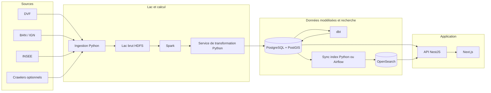

# HOMEPEDIA — Plateforme d’analyse du logement en France

## 1 Objectif

HOMEPEDIA est un produit piloté par les données qui aide à comprendre le marché du logement français via des cartes, la recherche, des filtres et des agrégations aux niveaux **commune, département et région**. Il combine des vues statistiques et géospatiales pour comparer les territoires et suivre l’évolution dans le temps. Au-delà des prix et des transactions, il vise un **profil de territoire** en croisant le logement avec des **indicateurs de contexte** (démographie, économie, éducation, énergie, environnement, infrastructures, services publics) à plusieurs échelles administratives.

### 1.1 Enrichissement par indicateurs (sourcing)

Principe : ingérer des jeux d’indicateurs depuis des sources ouvertes de confiance, les normaliser autour d’une **clé géographique** commune (codes INSEE + référentiels géographiques), puis publier des marts adaptés à l’API et à l’interface.

- **Logement et données « par bien » (prix, m², type, …)**
  - **DVF** : prix de **vente** notariée, date, surface et type de bien lorsque présents — une ligne par **transaction** ; les fichiers publics sont mis à jour selon un **calendrier** (adapté aux tendances et agrégats).
  - **Annonces** (crawl, optionel) : voie pour représenter « ce qui est sur le marché maintenant ».
  - **Modélisation** : en général `fact_transaction` + `dim_property` (DVF) et `fact_listing` (annonces), reliés à la géographie via la **BAN** / la commune (et l’IRIS si vous l’utilisez).

- **Socle géographique (jointures entre jeux)**
  - **COG INSEE** (communes, départements, régions, millésimes et fusions) : codes stables et hiérarchie.
  - **IGN Admin Express / périmètres type GEOFLA** : polygones pour choroplèthes ; géométrie en PostGIS.
  - **BAN (Base Adresse Nationale)** : référentiel adresse pour rattacher bien ou localisation à commune / IRIS.

- **Population et démographie**
  - **INSEE** : population, structure par âge, ménages, migrations, densité (commune / département / région ; parfois IRIS).

- **Économie et emploi**
  - **INSEE (Filosofi, revenus, pauvreté, fiscalité)** : distribution des revenus et indicateurs de pauvreté (souvent commune / IRIS).
  - **INSEE (SIRENE / nombre d’établissements)** : proxies du tissu économique par commune.
  - **DARES / France Travail open data (selon disponibilité)** : chômage et marché du travail (souvent département / zone).

- **Éducation**
  - **MENJ / open data Éducation nationale** : localisation d’établissements, effectifs, taux de réussite aux examens (souvent par établissement ; agréger à commune / département).
  - **INSEE** : niveau de diplôme via agrégats de recensement (commune / département / région).

- **Énergie et bâtiments**
  - **Open data DPE (ADEME / data.gouv)** : diagnostics de performance énergétique (granularité bâtiment / lot ; agréger par commune / IRIS, distributions A–G).
  - **Open data RTE / Enedis (selon cas)** : consommation / production électrique (souvent département / région).

- **Environnement et climat**
  - **Atmo France (qualité de l’air) / flux AASQA locales** : indices de pollution (stations → interpolation ou agrégation par zone).
  - **Copernicus / CORINE Land Cover** : occupation des sols, artificialisation (grille / polygones → agrégation aux périmètres admin).
  - **Normales climatiques (jeux ouverts lorsque la licence le permet)** : température / précipitations (grille → agrégation).

- **Infrastructures et accessibilité**
  - **Extraits OpenStreetMap (ex. Geofabrik)** : densité d’équipements, arrêts de transport, espaces verts (agrégats spatiaux).
  - **Open data ARCEP** : couverture et qualité internet (souvent commune / département).
  - **Flux SNCF / GTFS (lorsqu’ouverts)** : accessibilité aux gares et proxies de temps de parcours (isochrones, distance au point d’arrêt le plus proche).

Notes d’implémentation (plateforme de données) :
- Conserver les sources brutes en tables / fichiers `raw_*` ; disposer d’un `dim_location` clé par codes INSEE (et IRIS optionnel) comme cible de jointure principale.
- Publier des indicateurs **normalisés et horodatés** (ex. `indicator_unemployment_rate`, `indicator_income_median`) pour des séries et comparaisons cohérentes.

### 1.2 Sources retenues pour la problématique (mise à jour 2026-06-04)

**Problématique ciblée :** *Optimisation du choix de résidence — comment concilier capacité d'emprunt réelle et indicateurs de mixité sociale pour identifier les meilleures opportunités locales ?*

La problématique se décompose en trois briques. Toutes les sources se joignent sur le **code commune INSEE (COG)** comme clé géographique unique.

#### Brique A — Capacité d'emprunt réelle

`budget = mensualité_max(revenu_local, taux, durée) → capital_empruntable`, confronté au `prix_m²` de la commune.

| Indicateur | Source | Granularité | URL |
|------------|--------|-------------|-----|
| Prix / m² (transactions) | **DVF** (Etalab / data.gouv) | transaction géolocalisée | https://www.data.gouv.fr/datasets/demandes-de-valeurs-foncieres-geolocalisees/ |
| Revenu disponible médian par UC + déciles | **INSEE Filosofi** | commune (IRIS) | https://www.data.gouv.fr/datasets/revenus-et-pauvrete-des-menages-aux-niveaux-national-et-local-revenus-localises-sociaux-et-fiscaux |
| Taux de crédit immobilier / taux d'usure | **Banque de France** | national / trimestre | https://webstat.banque-france.fr/fr/themes/taux-et-cours/taux-de-usure/ |
| **Taux de crédit immobilier — série MIR** (alimente désormais la capacité d'emprunt, remplace le taux 0,035 codé en dur) | **BCE** (série MIR France) | national / **mensuel** | https://data.ecb.europa.eu/ |
| **Taxe foncière** (taux communal — charges du bien) | **DGFiP** | commune | https://www.data.gouv.fr/ |

#### Brique B — Indicateurs de mixité sociale

| Indicateur | Source | Granularité | URL |
|------------|--------|-------------|-----|
| Dispersion des revenus (rapport interdécile D9/D1, taux de pauvreté) | **INSEE Filosofi** | commune | https://www.data.gouv.fr/datasets/revenus-et-pauvrete-des-menages-aux-niveaux-national-et-local-revenus-localises-sociaux-et-fiscaux |
| Catégories socioprofessionnelles (CSP) & niveau de diplôme — **diversité CSP** (indice de Simpson) | **INSEE Recensement (RP)** | commune | https://www.data.gouv.fr/datasets/bases-de-donnees-et-fichiers-details-du-recensement-de-la-population |
| **Quartiers prioritaires de la ville (QPV)** — présence / mixité | **ANCT** | commune (périmètre QPV) | https://www.data.gouv.fr/ |
| Part de logements locatifs sociaux | **RPLS** (SDES) | commune | https://www.data.gouv.fr/datasets/donnees-detaillees-au-logement-du-repertoire-des-logements-locatifs-des-bailleurs-sociaux-rpls |
| Mixité scolaire (Indice de Position Sociale) | **IPS** (Éducation nationale) | établissement → commune | https://www.data.gouv.fr/datasets/ips-colleges-a-partir-de-2023 — écoles : https://data.education.gouv.fr/explore/assets/fr-en-ips-ecoles-ap2022/ |

#### Brique C — Socle géographique (clé de jointure)

| Indicateur | Source | Granularité | URL |
|------------|--------|-------------|-----|
| Codes communes / départements / régions (millésimes, fusions) | **COG INSEE** | commune | https://www.insee.fr/fr/information/2560452 |
| Polygones administratifs (choroplèthes) | **IGN Admin Express** | commune | https://geoservices.ign.fr/adminexpress |
| **Codes postaux ↔ code commune INSEE** (recherche par code postal) | **La Poste / Etalab** | code postal → commune | https://www.data.gouv.fr/ |

#### Points d'attention (data engineering)

- **Agrégation à la commune** : DVF est à la transaction, Filosofi/RPLS à la commune (parfois IRIS), IPS à l'établissement → tout ramener à la commune via le code INSEE.
- **Millésimes** : aligner Filosofi, recensement et RPLS sur une année de référence cohérente.
- **Secret statistique** : Filosofi masque les communes < ~1 000 hab. / 50 ménages → prévoir un fallback (niveau département).
- **Sécurité (qualité de vie)** : la **délinquance communale** (**SSMSI**, bases statistiques des crimes et délits enregistrés) alimente la dimension sécurité du score, en inverse (moins de délinquance = meilleur score) — https://www.data.gouv.fr/ (commune).
- **Cible** : ces sources alimentent désormais **toutes** les dimensions du mart `app_opportunity_score` (HOM-79), qui n'est plus basé sur DVF seul mais croise prix, mixité sociale et qualité de vie (voir §6.3).
- **Câblage standard d'une source** : chaque nouvelle source (taux crédit BCE, taxe foncière DGFiP, QPV ANCT, RP-CSP INSEE, délinquance SSMSI, codes postaux La Poste) suit le même patron — **loader Python** + **`schema.sql`** + **script `scripts/load_*.sh`** + **modèles dbt** (staging → core) + **tâche Airflow**. Toutes sont ajoutées à l'orchestrateur global `scripts/load_all_default.sh`.

#### Brique D — Environnement sonore (qualité de vie)

Indicateur « calme vs bruyant » d'une zone. Donnée **géospatiale** → exploitée via PostGIS.

| Indicateur | Source | Granularité | URL |
|------------|--------|-------------|-----|
| Bruit transport (route, fer, air) — indices **Lden** / **Lnight** | **Cartes de Bruit Stratégiques (CBS)** — CEREMA / PlaMADE / NoiseModelling, directive 2002/49/CE | polygones de contours sonores (par département) | https://www.data.gouv.fr/datasets/cartes-de-bruit-strategiques-des-reseaux-routiers-et-ferroviaires-non-concedes-directive-europeenne-2002-49-ce/ |
| Bruit mesuré (modélisé + capteurs), focus IDF | **Bruitparif** — opendata air-bruit | zones / stations | https://www.bruitparif.fr/opendata-air-bruit/ |

**Portée et limites (important).** Les CBS ne couvrent **que** 4 sources de transport/industrie : routes (> 3 M véhicules/an), voies ferrées (> 30 000 trains/an), aéroports (> 50 000 mouvements/an) et sites industriels classés en agglomération. Elles **excluent explicitement le bruit de voisinage** : bars, terrasses, restaurants, cours d'école, vie nocturne. Une rue calme côté trafic peut donc être bruyante à cause de l'activité, sans apparaître dans les CBS. Bruitparif mesure le bruit festif (capteurs « Méduse » / monquartier) mais **uniquement à Paris**, à titre expérimental → non exploitable pour un scoring national.

**Proxys pour le bruit d'activité (bars / écoles / vie locale).** Faute de mesure directe nationale, on approxime par la **densité de points d'intérêt** :

| Indicateur proxy | Source | Tag / champ |
|------------------|--------|-------------|
| Densité bars / pubs / boîtes de nuit | **OpenStreetMap** (Geofabrik) | `amenity=bar/pub/nightclub` |
| Densité restaurants / terrasses | **OpenStreetMap** | `amenity=restaurant` |
| Présence d'écoles | **OpenStreetMap** / [annuaire éducation](https://data.education.gouv.fr) | `amenity=school` |
| Débits de boissons (établissements) | **INSEE SIRENE** | NAF 56.30Z |
| Signalements de bruit (où disponible) | open data ville (ex. Paris – DansMaRue) | catégorie « bruit » |

**Notes d'intégration.**
- Approche recommandée : **CBS** (bruit de transport, national, fiable) **+ densité de POI OSM** (proxy du bruit d'activité) pour un indicateur « ambiance sonore » plus complet.
- Agrégation à la commune via PostGIS : `ST_Intersection` / `ST_Area` pour calculer le **% de surface (ou de population) exposée à > 55 dB / > 65 dB Lden**.
- Ambivalence : la densité de bars/écoles est à la fois une **nuisance sonore** et un **service de proximité attractif** → envisager **deux indicateurs distincts** (animation vs calme) plutôt qu'un seul.

## 2 Objectif pédagogique et de livraison

Livrable : une **plateforme de données scalable** et une **application web** qui illustrent :

| Domaine | Technologies |
|---------|--------------|
| Big data | Hadoop, HDFS, Spark (PySpark) |
| Data engineering | Python, ETL, Airflow, dbt |
| API | NestJS (Node.js) |
| Client | Next.js (React) |
| Géospatial | PostgreSQL + PostGIS |

---

## 3 Architecture de haut niveau

Les données issues de sources externes transitent par le traitement batch et la modélisation vers des stockages qui alimentent une API et un frontend Next.js. **Règle retenue :** l’entrepôt (Postgres + marts dbt) est la **source de vérité unique** pour les données structurées ; **OpenSearch est une projection optimisée pour la lecture**, construite **après** les marts, et non en parallèle depuis le service de transformation.



**Fil narratif :** sources → ingestion → **HDFS** (historique de fichiers immuable) → **Spark** (nettoyage à l’échelle) → **service de transformation** (charge les **`raw_*`** Postgres, géocodage, API, logique peu adaptée au SQL) → **dbt** (staging → core → marts, tests) → **synchronisation d’index** (mart matérialisé → API bulk OpenSearch) → **NestJS** lit Postgres et OpenSearch → interface **Next.js**.

### 3.1 Responsabilité de chaque couche

| Enjeu | Responsable | Notes |
|--------|-------------|--------|
| Historique fidèle à l’octet, rejouabilité | **HDFS** | Fichiers tels que collectés ou exportés ; non interrogés par l’app. |
| Première entrée **relationnelle** dans l’entrepôt | **Service de transformation → Postgres `raw_*`** | Chargé depuis les sorties Spark (ou chargements directs contrôlés). Encore « brut » pour dbt : colonnes larges, particularités des sources. |
| Clés conformes, schéma en étoile, agrégats | **dbt** sur Postgres | Vues de staging, `int_*` / `normalized_*`, `dim_*` / `fact_*` / `agg_*`. |
| Index recherche plein texte / facettes | **Synchronisation d’index** lisant les **marts** (ex. `mart_search_*`) | Garde la recherche alignée sur les tables exposées à l’API ; évite de dupliquer les règles entre TS et dbt. |

---

## 4 Choix technologiques

### 4.1 Frontend

- **Next.js** (React)
- **MapLibre** (où **Mapbox**) -- rendu cartographique
- **Apache ECharts** — graphiques

### 4.2 Backend

- **NestJS** — API HTTP, services métier, intégration PostgreSQL et OpenSearch

### 4.3 Plateforme de données

- **Python** — ingestion, code de liaison, service de transformation
- **PySpark** — traitement distribué sur les données du lac
- **Apache Airflow** — orchestration des workflows
- **dbt** — transformations SQL et documentation

### 4.4 Stockage et recherche

- **HDFS** — fichiers bruts immuables et historique (data lake)
- **PostgreSQL + PostGIS** — tables structurées, géométrie, index spatiaux
- **OpenSearch** — recherche plein texte et à facettes

### 4.5 Analyse et exploration (hors chemin produit principal)

- Notebooks Jupyter
- Outils BI (ex. Superset, Metabase) ou stack analytique managée (ex. Databricks)

---

## 5 Pipeline de données (étapes)

1. **Ingestion** — Extraction DVF (transactions), BAN/IGN (adresses et géographie), INSEE (démographie), et éventuellement annonces crawlées. Les sorties atterrissent dans une arborescence brute contrôlée.
2. **Stockage brut** — Persistance des fichiers sur HDFS ; conservation de l’historique pour rejouer et auditer.
3. **Traitement (Spark)** — Nettoyage, normalisation de schéma, déduplication, enrichissement à l’échelle.
4. **Service de transformation (Python)** — Parsing, géocodage, normalisation par règles, détection légère d’anomalies, et toute logique mal adaptée au dbt SQL uniquement.
5. **Modélisation (dbt)** — Staging → core → marts ; tests et documentation sur les modèles critiques.
6. **Index de recherche** — Après construction des marts, un job de **synchronisation d’index** dénormalise un mart dédié (ex. `mart_search_property`) vers OpenSearch.
7. **Serving** — NestJS interroge PostgreSQL/PostGIS pour les parcours carte et analytiques ; saisie semi-automatique et recherche textuelle lourde passent par OpenSearch si besoin.
8. **API et UI** — NestJS sert du JSON (et les endpoints géospatiaux définis) ; Next.js consomme l’API et affiche MapLibre (ou Mapbox) + ECharts.

**Orchestration Airflow.** Le pipeline est découpé en **5 DAGs de domaine** — `referentiels` (socle géographique : COG, IGN, codes postaux), `logement` (DVF, prix), `demo` (démographie / mixité : Filosofi, RP-CSP, QPV), `emprunt` (taux crédit BCE, taxe foncière) et `cadre_vie` (BPE, délinquance SSMSI) — suivis d'un DAG terminal **`gold_refresh`** qui reconstruit les marts de publication (dont `app_opportunity_score`) une fois les domaines chargés.

---

## 6 Modèle de données (couches et nommage)

Penser en **quatre couches d’entrepôt** dans Postgres, **après** le lac : **raw** (chargé par le service de transformation), **staging** (vues dbt fines sur `raw_*`), **core** (entités et clés conformes), **marts** (faits, agrégats et modèles de publication pour API/recherche). **HDFS** porte l’historique **fichier** immuable ; les **`raw_*` dans Postgres** sont la première forme **table** que voit l’entrepôt (souvent alimentée par les sorties Spark), ce qui donne à dbt un point d’entrée SQL stable.

| Couche | Emplacement typique | Motif de nommage | Rôle |
|--------|---------------------|------------------|------|
| Raw | Tables Postgres chargées par le service de transformation | `raw_<source>` | Première entrée relationnelle ; append ou snapshot par lot ; correspond au « brut entrepôt », pas nécessairement octet à octet avec les fichiers HDFS. |
| Staging | dbt `staging/` | `stg_<source>__<entity>` | Une ligne par ligne brute ; renommages de colonnes, casts, nettoyage spécifique à la source. |
| Core | dbt `core/` | `normalized_*` ou `int_*` | Clés de substitution, déduplication, golden record adresse, jointures entre sources. |
| Marts | dbt `marts/` | `dim_*`, `fact_*`, `agg_*`, `mart_*` | Schéma en étoile, rollups et modèles de **publication** (ex. `mart_search_*` pour OpenSearch) ; granularité documentée par fait. |

### 6.1 Raw (tel qu’ingéré ou légèrement typé)

- `raw_dvf` — Fichiers de transactions DVF tels qu’atterris.
- `raw_listings` — Payloads d’annonces crawlées ou partenaires.
- `raw_insee` — Référentiels INSEE ou extractions recensement.

*Optionnel :* `raw_ban` ou `raw_ign` si les fichiers adresse ou limites administratives sont chargés séparément du DVF.

### 6.2 Core / normalisé (entités conformes)

Il s’agit d’**entités métier stables** avec des clés référencées par le reste du modèle :

- `normalized_address` — Adresse canonique (liaison BAN, géocode, `geom`), souvent colonne vertébrale carte et recherche.
- `normalized_sale` — Une ligne par transaction DVF (ou enrichie) avec liens vers adresse et attributs du bien.
- `normalized_listing` — Une ligne par snapshot ou version d’annonce si les données crawl sont utilisées.

*Pistes d’amélioration :* **clés de substitution** explicites (`address_id`, `sale_id`) partout en aval ; une seule **`normalized_property`** ou attributs sur `normalized_sale` si un concept réutilisable « parcelle / lot » distinct de chaque transaction est nécessaire.

### 6.3 Dimensions, faits et agrégats (marts dbt)

Documenter la **granularité** sur chaque fait (ex. « une ligne par vente notariée » vs « une ligne par annonce-jour »).

- **Dimensions :** `dim_location` (hiérarchie commune → département → région, codes INSEE, `geom` optionnel pour choroplèthe), `dim_property` (type, surfaces, pièces — attributs du bien).
- **Faits :** `fact_transaction` (ventes ; mesures prix, prix/m², dates), `fact_listing` (annonces ; mesures prix demandé, délai de vente si calculé).
- **Agrégates / aides au serving :** `agg_price_city`, `agg_price_department`, `agg_price_region`, `agg_map_tiles` (pré-buckets par niveau de zoom pour éviter à l’API des agrégations spatiales ad hoc lourdes).
- **Modèle de publication recherche :** `mart_search_property` (ou équivalent) — une ligne dénormalisée par document searchable ; **seule** entrée de l’index OpenSearch dans cette architecture, construite par **synchronisation d’index** après exécution dbt (voir §3).
- **Score d'opportunité :** `app_opportunity_score` — grain **commune × mois**, mart applicatif du parcours « meilleures opportunités locales ». Il agrège trois dimensions normalisées :
  - `price_score` — **percentile inversé du prix/m²** (moins cher = meilleur), issu de DVF ;
  - `social_mix_score` — **mixité sociale** : revenu médian + faible taux de pauvreté (Filosofi) + **diversité CSP** (indice de **Simpson** sur le RP, exposé via `csp_diversity_index`) + **faible présence de QPV** (ANCT) ;
  - `quality_of_life_score` — **qualité de vie** : densité d'équipements **BPE** + **sécurité** (inverse de la délinquance **SSMSI**).

  **Capacité d'emprunt** : le score confronte le prix à la capacité d'emprunt réelle. Le **taux réel de la BCE** (série MIR) remplace l'ancien taux `0.035` codé en dur ; les colonnes `borrowing_capacity_eur` et `price_to_capacity_ratio` sont calculées, aux côtés de `csp_diversity_index` et `property_tax_rate_pct` (taxe foncière DGFiP). La dimension `transit_accessibility` (GTFS) reste **NULL** : donnée non encore récupérée.

*Optionnel :* `dim_date` pour des hiérarchies temporelles cohérentes ; tables `mart_*` supplémentaires pour des réponses API spécifiques si l’on veut éviter de joindre trop de dimensions à la requête.

### 6.4 Nommage et habitudes de gouvernance

- Privilégier les noms de tables en **snake_case** ; réserver les préfixes `raw_`, `stg_`, `int_`, `dim_`, `fact_`, `agg_`, `mart_` pour que les couches restent lisibles dans l’entrepôt.
- Ajouter des **tests dbt** (not null, unicité des clés, valeurs acceptées) aux frontières core et mart.
- Stocker des **dates d’effet** sur les dimensions à changement lent (ex. évolution des limites INSEE ou des noms de communes) si les libellés cartographiques historiques comptent.

---

## 7 Fonctionnalités produit

### 7.1 Cœur de produit

- Carte interactive (ex. prix au m²)
- **Recherche par code postal** (résolution code postal → commune via le référentiel La Poste/Etalab), par ville et par adresse
- Filtres (prix, surface, type de bien)
- Tendances historiques
- **Classement (ranking)** des communes selon le score d'opportunité

### 7.2 Avancé

- Cartes de chaleur et choroplèthes
- Comparaison côte à côte de zones
- Graphiques d’évolution du marché
- Estimation de valeur (lorsque méthodologie et données le permettent)
- Couverture **DROM-COM** en plus de la métropole

### 7.3 Bloc « Accessibilité » et expérience

- **Bloc « Accessibilité » (`AffordabilityCard`)** — affiche la **capacité d'emprunt réelle** de l'utilisateur (calculée avec le taux BCE réel, `borrowing_capacity_eur`) et son rapport au prix local (`price_to_capacity_ratio`).
- **Carrousel thématique** — mise en avant de thématiques / territoires.
- **Tour guidé** (onboarding rejouable) pour la prise en main.
- **Temps réel** — bascule d'auto-rafraîchissement (auto-refresh toutes les 30 s).
- **Internationalisation FR/EN** (i18n) et thème **clair / sombre** (dark/light).

---

## 8 Glossaire (composants clés)

| Composant | Rôle |
|-----------|------|
| **HDFS** | Stockage fichier distribué pour gros jeux bruts ; entrée Spark, pas moteur de requêtes. |
| **Spark** | Traitement batch parallèle sur les fichiers du lac. |
| **Service de transformation** | Charge les **`raw_*`** dans Postgres, géocodage, parsing, API externes, logique peu adaptée au SQL ; ne **détient pas** le schéma en étoile final (dbt le fait). |
| **dbt** | Modèles SQL versionnés, tests et documentation au-dessus de PostgreSQL. |
| **PostGIS** | Types spatiaux, prédicats et index pour les requêtes derrière la carte. |
| **Synchronisation d’index** | Job batch (Python / Airflow) qui lit une table **`mart_search_*`** et met à jour en masse **OpenSearch** pour aligner la recherche sur les marts. |
| **OpenSearch** | Recherche et facettes pour l’app ; **dérivé** des marts, non chargé directement depuis le service de transformation. |

---

## 9 Plan de livraison par phases

| Phase | Focus | Livrables |
|-------|--------|-----------|
| 1 — Conception | Architecture et contrats | Inventaire des sources, schéma cible, ébauche d’API |
| 2 — Ingestion | Atterrissage des données brutes | Jobs Python reproductibles, arborescence HDFS |
| 3 — Traitement | Spark + transformation | Entités nettoyées prêtes au chargement |
| 4 — Modélisation | dbt | Staging, core, agrégats testés en CI |
| 5 — Application | API + UI | Endpoints NestJS ; carte et graphiques Next.js |
| 6 — Exploitation et analyse | Airflow + BI | Pipelines planifiés ; tableaux de bord optionnels |

---

## 10 Risques et contraintes

- **Qualité des données** — Doublons, adresses partielles, codages incohérents entre sources.
- **Normalisation d’adresse** — Précision du géocodage et maintien d’une clé adresse de référence.
- **Performance carte** — Limites tuiles ou vecteurs, taille des payloads, budget frame côté client.
- **Crawling** — Limites de débit, dérive HTML, cadre juridique/CGU.
- **Juridique et éthique** — Usage des données publiques et tierces dans le cadre français et européen.

---

## 11 Arborescence monorepo suggérée

```
homepedia/
├── frontend/                 # Next.js
│   ├── components/
│   ├── pages/                # ou app/ avec App Router
│   ├── hooks/
│   └── services/
├── backend/                  # NestJS
│   ├── src/
│   │   └── modules/
│   └── tests/
├── data-platform/
│   ├── ingestion/            # dvf, insee, ban, crawlers
│   ├── spark/                # jobs, utils
│   ├── transform-service/    # services, pipelines, domaine ; charge raw_* vers Postgres
│   ├── dbt/                  # modèles (staging, core, marts), tests
│   ├── search-indexer/       # mart_search_* → OpenSearch (ou intégré dans airflow/)
│   ├── airflow/              # DAGs : ordre Spark, TS, dbt, sync index
│   ├── notebooks/
│   └── common/
├── infra/                    # Docker, IaC, config par environnement
└── docs/                     # Architecture, ADR, rapports
```

### 11.1 Déploiement (conteneurs)

La plateforme se déploie via une stack Docker : **`backend/Dockerfile`** (API NestJS), **`frontend/Dockerfile`** (Next.js) et un **`docker-compose.prod.yml`** qui orchestre l'ensemble des services en production. La procédure complète est décrite dans **`docs/deploiement_fr.md`**.
